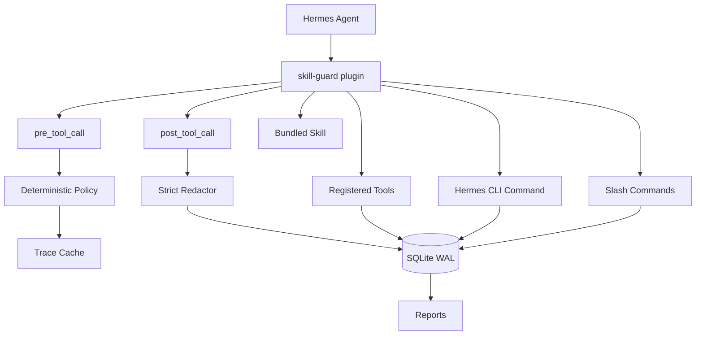

# hermes-skill-guard

[](https://pypi.org/project/hermes-skill-guard/)
[](https://www.python.org/)
[](https://github.com/elliotten99/hermes-skill-guard/actions/workflows/ci.yml)
[](https://docs.astral.sh/ruff/)
[](https://mypy-lang.org/)
[](LICENSE)

Languages: English | [简体中文](README.zh-CN.md)

Review Hermes skills before they become permanent agent behavior.

`hermes-skill-guard` is a Hermes Agent plugin for teams that let agents create
skills, but do not want those skills to skip review. It watches explicit
`skill_manage create` calls, runs deterministic checks, stores redacted
evidence, and gives operators a small review queue.

The default install is intentionally boring: audit-only, no blocking, no raw
payload capture, no background filesystem watcher, and no model call in the
policy path.

Current package line: `0.1.x` beta. The implementation targets Hermes Agent
v0.14.0 (`v2026.5.16`) and newer `main` commits.

## The problem

Skills are durable agent capabilities. Once created, they can be reused on
future requests, often with broader context than the original author expected.
That is useful, but it needs a paper trail.

| Risk | What can go wrong | What skill-guard adds |
|---|---|---|
| Shadow tools | A skill wraps internal APIs or bypasses review paths | preflight policy and candidate review |
| Secret leakage | Prompt or config data lands in skill text or logs | strict redaction and raw payload opt-in only |
| Capability creep | A narrow helper becomes a broad persistent tool | candidate status, relations, and reports |
| Chain-of-trust breaks | Agent-created skills create more skills | explicit promotion attempts and audit trails |

## Quick start

Install the plugin package:

```bash
pip install hermes-skill-guard
hermes plugins enable skill-guard
```

Check local health:

```bash
hermes-skill-guard doctor
```

The output is JSON. On a healthy local install, it has this shape:

```json
{
  "ok": true,
  "check": "all",
  "doctor": {
    "storage": {
      "wal_enabled": true,
      "summary": {
        "sqlite_journal_mode": "wal"
      }
    }
  }
}
```

Start with a read-only report and the candidate queue:

```bash
hermes-skill-guard report --json
hermes-skill-guard candidates list
```

Inside Hermes, use the plugin tools or slash commands:

```text
/skill-guard-doctor
/skill-guard-report
```

For the full operator path, see [Getting Started](docs/getting-started.md).

## Modes

| `dry_run` | `enforcement.mode` | Hook behavior |
|---:|---|---|
| `true` | `audit` | Default. Records warnings and lets Hermes continue. |
| `true` | `candidate` or `block` | Still audit-only. `dry_run` always wins. |
| `false` | `candidate` | Blocks the creation path and routes the item into review. |
| `false` | `block` | Blocks the creation path with a deterministic policy reason. |

Recommended rollout:

```bash
# observe first; this is the default posture
export SKILL_GUARD_DRY_RUN=true
export SKILL_GUARD_ENFORCEMENT_MODE=audit

# later, route risky creates into review
export SKILL_GUARD_DRY_RUN=false
export SKILL_GUARD_ENFORCEMENT_MODE=candidate
```

## CLI

```bash
hermes-skill-guard doctor
hermes-skill-guard report --json
hermes-skill-guard candidates list
hermes-skill-guard candidates details <id>
hermes-skill-guard candidates approve <id>
hermes-skill-guard candidates reject <id>
hermes-skill-guard candidates promote <id>
hermes-skill-guard candidates auto-promote
hermes-skill-guard relations add <source> <target> <type> --reasons "..."
hermes-skill-guard relations list
hermes-skill-guard compat probe
hermes-skill-guard compat list
hermes-skill-guard rules list
hermes-skill-guard rules validate --path ./rules.json
hermes-skill-guard storage rotate
hermes-skill-guard verify package dist/*.whl dist/*.tar.gz
```

The plugin also registers these Hermes tools:

- `skill_guard_doctor`
- `skill_guard_preflight`
- `skill_guard_candidates`
- `skill_guard_promote`
- `skill_guard_relations`
- `skill_guard_report`
- `skill_guard_compat`
- `skill_guard_auto_promote`

## How it works



What is deliberately not in the hot path:

- Pure Hermes plugin API; no Hermes core patching.
- Hook-based observation; no filesystem watcher.
- SQLite WAL state under the operator account.
- Strict redaction by default; raw payload previews require explicit opt-in.
- Deterministic rules only.
- Fail-open defaults, so the agent is not taken down by a guard failure.
- Protocol gating retires plugin intents already covered by first-party Hermes
  capabilities.

## Docs

| Document | Use it when |
|---|---|
| [Documentation index](docs/index.md) | You want the map of tutorials, references, and design notes. |
| [Getting Started](docs/getting-started.md) | You want the 5-minute install and audit-mode walkthrough. |
| [Configuration](docs/configuration.md) | You need YAML/env settings, enforcement modes, rules, or metrics. |
| [Runtime Safety](docs/runtime-safety.md) | You are reviewing threat model, redaction, and fail-open behavior. |
| [Rule Engine](docs/rule-engine.md) | You want to customize deterministic policy. |
| [Hermes Protocol](docs/hermes-protocol.md) | You are integrating against Hermes hook/tool semantics. |
| [Architecture](docs/architecture.md) | You want component boundaries and data flow. |
| [Data Model](docs/data-model.md) | You need schema, retention, and migration details. |
| [Observability](docs/observability.md) | You want OpenTelemetry or Prometheus metrics. |
| [Publishing](docs/publishing.md) | You are preparing a release. |
| [FAQ](docs/faq.md) | You want short operational answers. |
| [Roadmap](ROADMAP.md) | You want planned work and project direction. |
| [Security](SECURITY.md) | You need vulnerability reporting guidance. |

Chinese documentation starts at [中文文档索引](docs/zh-CN/index.md).

## Development

```bash
uv sync --locked --extra dev
uv run --locked --extra dev pytest
uv run --locked --extra dev ruff check src tests
uv run --locked --extra dev ruff format --check src tests
uv run --locked --extra dev mypy src tests
./scripts/verify-release.sh
```

Tests cover unit behavior, hook flow, CLI commands, storage, golden fixtures,
rule evaluation, relation review, observability, and package contents.

## Acknowledgements

This project is an original implementation inspired by earlier skill-governance
experiments, including hermes-curator-evolver, SkillClaw, asm, skill-flow, and
skill-scanner. No third-party code is copied unless explicitly noted.
