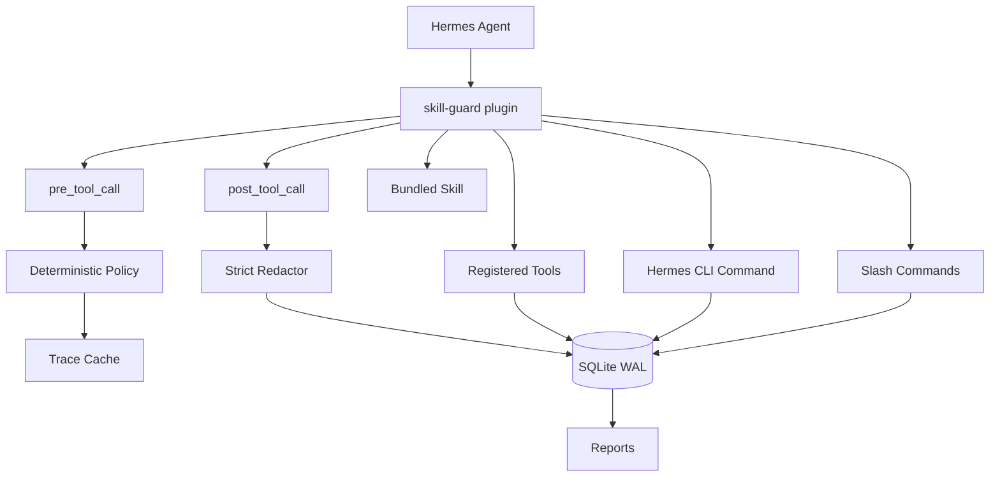

# hermes-skill-guard

[](https://pypi.org/project/hermes-skill-guard/)
[](https://www.python.org/)
[](https://github.com/elliotten99/hermes-skill-guard/actions/workflows/ci.yml)
[](https://docs.astral.sh/ruff/)
[](https://mypy-lang.org/)
[](LICENSE)

语言：[English](README.md) | 简体中文

在 Hermes skill 变成长期 agent 行为之前，先把它放到审计和 review 里。

`hermes-skill-guard` 是一个 Hermes Agent 插件，适合那些允许 agent 创建
skills、但不想让这些 skills 绕过审查的团队。它会观察明确的
`skill_manage create` 调用，执行确定性的策略检查，保存脱敏后的证据，并提供一个很小的候选队列给 operator 做 review。

默认安装是保守的：只审计、不阻断、不采集原始 payload、没有后台文件监听器，策略路径里也不会调用模型。

当前包线：`0.1.x` beta。目标 Hermes Agent 版本是 v0.14.0
(`v2026.5.16`) 及更新的 `main` 提交。

## 它解决什么问题

Skill 是持久化的 agent 能力。创建之后，它会在未来请求里被重复使用，接触到的上下文也可能比创建时更宽。这个能力有用，但需要留下审计轨迹。

| 风险 | 可能出什么事 | skill-guard 做什么 |
|---|---|---|
| 影子工具 | skill 包了一层内部 API，绕过已有 review 路径 | preflight 策略和候选 review |
| 密钥泄漏 | prompt、配置或 token 进入 skill 文本或日志 | 默认严格脱敏，原始 payload 只能显式打开 |
| 能力蔓延 | 一个窄用途 helper 被长期复用到更宽场景 | 候选状态、关系标注和报告 |
| 信任链断裂 | agent 创建的 skill 又继续创建 skill | promotion attempt 和审计日志 |

## 快速开始

安装插件：

```bash
pip install hermes-skill-guard
hermes plugins enable skill-guard
```

检查本地状态：

```bash
hermes-skill-guard doctor
```

输出是 JSON。健康的本地安装大致是这样：

```json
{
  "ok": true,
  "check": "all",
  "doctor": {
    "storage": {
      "wal_enabled": true,
      "summary": {
        "sqlite_journal_mode": "wal"
      }
    }
  }
}
```

先看只读报告和候选队列：

```bash
hermes-skill-guard report --json
hermes-skill-guard candidates list
```

在 Hermes 里可以使用 slash commands：

```text
/skill-guard-doctor
/skill-guard-report
```

完整 operator 流程见 [中文快速开始](docs/zh-CN/getting-started.md)。

## 模式

| `dry_run` | `enforcement.mode` | hook 行为 |
|---:|---|---|
| `true` | `audit` | 默认。记录 warning，让 Hermes 继续执行。 |
| `true` | `candidate` 或 `block` | 仍然只审计。`dry_run` 优先级最高。 |
| `false` | `candidate` | 阻断创建路径，把条目送进 review。 |
| `false` | `block` | 直接按确定性策略原因阻断。 |

推荐上线顺序：

```bash
# 先观察；这是默认姿态
export SKILL_GUARD_DRY_RUN=true
export SKILL_GUARD_ENFORCEMENT_MODE=audit

# 稳定后，把风险创建送进 review
export SKILL_GUARD_DRY_RUN=false
export SKILL_GUARD_ENFORCEMENT_MODE=candidate
```

## CLI

```bash
hermes-skill-guard doctor
hermes-skill-guard report --json
hermes-skill-guard candidates list
hermes-skill-guard candidates details <id>
hermes-skill-guard candidates approve <id>
hermes-skill-guard candidates reject <id>
hermes-skill-guard candidates promote <id>
hermes-skill-guard candidates auto-promote
hermes-skill-guard relations add <source> <target> <type> --reasons "..."
hermes-skill-guard relations list
hermes-skill-guard compat probe
hermes-skill-guard compat list
hermes-skill-guard rules list
hermes-skill-guard rules validate --path ./rules.json
hermes-skill-guard storage rotate
hermes-skill-guard verify package dist/*.whl dist/*.tar.gz
```

插件注册的 Hermes tools：

- `skill_guard_doctor`
- `skill_guard_preflight`
- `skill_guard_candidates`
- `skill_guard_promote`
- `skill_guard_relations`
- `skill_guard_report`
- `skill_guard_compat`
- `skill_guard_auto_promote`

## 工作原理



热路径里刻意没有这些东西：

- 不 patch Hermes core，只使用插件 API。
- 只通过 hook 观察，不做后台文件监听。
- 状态写入 operator 用户下的 SQLite WAL。
- 默认严格脱敏，原始 payload preview 需要显式开启。
- 策略是确定性的，不在策略路径里调用模型。
- 默认 fail-open，guard 自己出错时不拖垮 agent。
- Hermes 官方已有能力覆盖某个 intent 时，protocol gating 会让插件 intent 退休。

## 文档

| 文档 | 什么时候看 |
|---|---|
| [中文文档索引](docs/zh-CN/index.md) | 想看中文入口、教程和架构图。 |
| [快速开始](docs/zh-CN/getting-started.md) | 想跑通安装、doctor 和 audit mode。 |
| [架构说明](docs/zh-CN/architecture.md) | 想理解 hook、存储、候选状态和数据流。 |
| [English docs](docs/index.md) | 需要完整英文文档。 |
| [Security](SECURITY.md) | 需要报告安全问题。 |

## 开发

```bash
uv sync --locked --extra dev
uv run --locked --extra dev pytest
uv run --locked --extra dev ruff check src tests
uv run --locked --extra dev ruff format --check src tests
uv run --locked --extra dev mypy src tests
./scripts/verify-release.sh
```

测试覆盖 unit、hook flow、CLI、storage、golden fixtures、rule engine、关系 review、observability 和包内容验证。

## GitHub 仓库信息建议

仓库描述：

```text
Hermes Agent plugin that audits and gates agent-created skills before they become persistent behavior.
```

Topics：

```text
hermes-agent, ai-agents, agent-security, skills, plugins, python, governance, policy-engine, sqlite, security-tools
```

## 致谢

这个项目是原创实现，灵感来自 hermes-curator-evolver、SkillClaw、asm、skill-flow 和 skill-scanner 等 skill governance 实验。除非明确说明，没有复制第三方代码。
