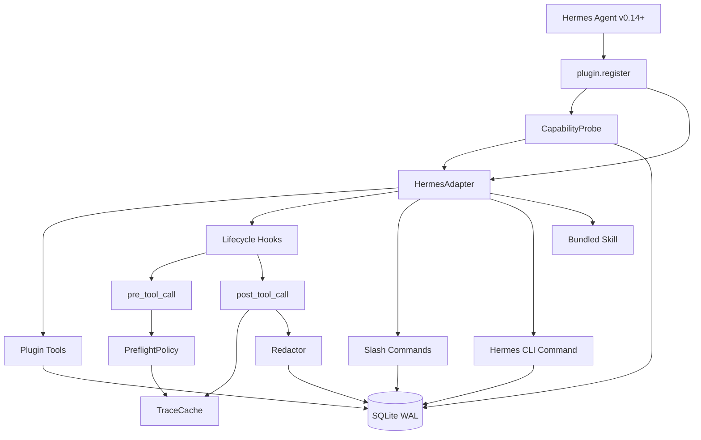

# Architecture

`hermes-skill-guard` is a Hermes plugin, not a Hermes core patch. It uses the
v0.14 plugin API to register tools, hooks, slash commands, a CLI command, and a
bundled read-only skill.

## Runtime Parts

- `HermesAdapter`: defensive wrapper around Hermes `PluginContext`; real v0.14
  keyword signatures are the primary registration path.
- `PreflightIntent`: registers `skill_guard_preflight` and the `pre_tool_call`
  hook.
- `CaptureIntent`: registers the `post_tool_call` hook and persists redacted
  events.
- `CompatibilityIntent`: registers `skill_guard_compat` and probes the
  bundled Hermes capability matrix during `register()`. Intents covered by a
  first-party Hermes feature are marked `retired_by_official` and skipped.
- `CandidatesIntent`: registers manual candidate listing, approval, and
  rejection.
- `PromotionIntent`: tracks promotion attempts and finalizes the candidate
  state machine when the official `skill_manage create` is observed.
- `RelationsIntent`: registers `skill_guard_relations` for `duplicate`,
  `conflict`, `supersedes`, `depends_on`, and `related_to` relations between
  candidates.
- `ReportingIntent`: registers `skill_guard_report`, `skill_guard_doctor`,
  slash commands, and the `hermes skill-guard ...` CLI bridge. Doctor
  diagnostics live inside this intent and are not a separate intent surface.
- `StateStore`: SQLite WAL-backed state, transitions, counters, summaries,
  promotion attempts, skill relations, and module status rows.

## Data Flow

1. Hermes calls `pre_tool_call` before each tool execution.
2. Non-`skill_manage` calls are allowed and cached with low confidence.
3. `skill_manage create` calls are evaluated by deterministic rules.
4. The decision is cached by `tool_call_id` when available.
5. Hermes executes the tool.
6. Hermes calls `post_tool_call` with the original args, result, duration, and
   `tool_call_id`.
7. The plugin redacts the payload, writes an event, and writes the audit row
   when the preflight decision is found.

## Review Boundaries

The plugin does not watch the filesystem, replace the curator, scan all skills,
or promote candidates automatically. Those are separate future features and
must be added as explicit intents with tests and docs.
