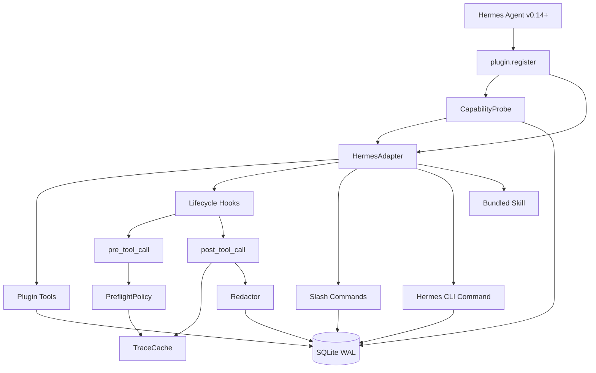
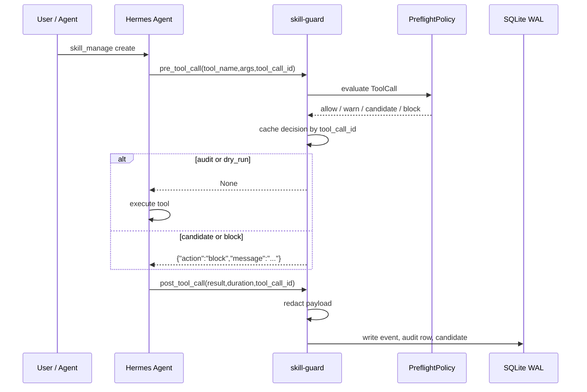
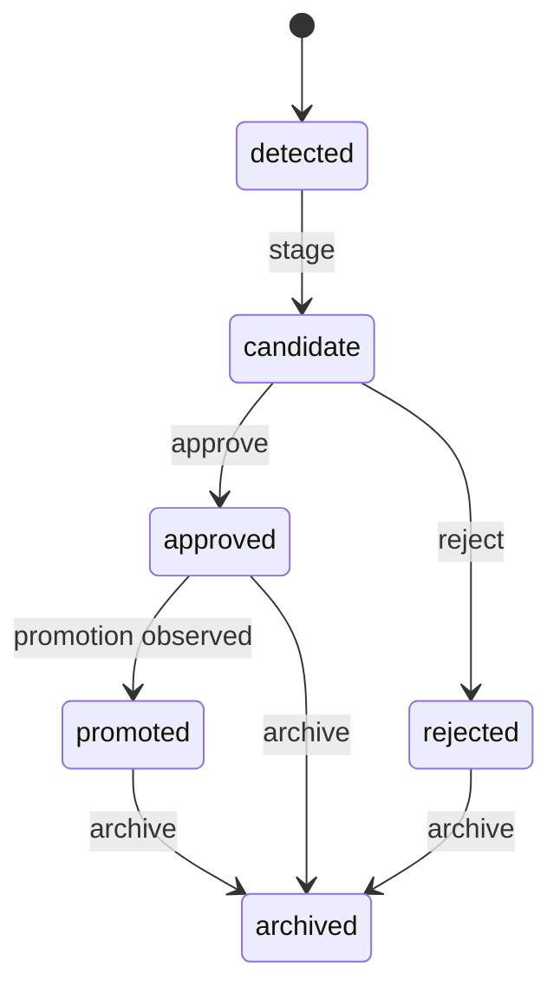

# 架构说明

语言：[English](../architecture.md) | 简体中文

`hermes-skill-guard` 是 Hermes 插件，不是 Hermes core patch。它通过
Hermes v0.14 插件 API 注册 tools、hooks、slash commands、CLI command 和一个只读 bundled skill。

## 组件图

## 一次 skill 创建的路径

## 候选状态

## 主要模块

| 模块 | 责任 |
|---|---|
| `HermesAdapter` | 包一层 Hermes `PluginContext`，优先使用 v0.14 keyword signatures。 |
| `PreflightIntent` | 注册 `skill_guard_preflight` 和 `pre_tool_call`。 |
| `CaptureIntent` | 注册 `post_tool_call`，持久化脱敏事件。 |
| `CompatibilityIntent` | 探测 Hermes capability matrix，退休已被官方能力覆盖的 intent。 |
| `CandidatesIntent` | 候选列表、批准、拒绝和详情。 |
| `PromotionIntent` | promotion attempt 和状态机收敛。 |
| `RelationsIntent` | 标记 duplicate、conflict、supersedes、depends_on、related_to。 |
| `ReportingIntent` | `report`、`doctor`、slash commands 和 Hermes CLI bridge。 |
| `AutoPromoteIntent` | 扫描已批准候选，并在时间和关系 gate 通过后创建 promotion attempt。 |
| `StateStore` | SQLite WAL 存储、迁移、counter、候选状态和 module status。 |

## 边界

插件不做这些事：

- 不监听整个 skills 文件夹。
- 不替代 Hermes curator。
- 不扫描所有已有 skill。
- 不默认自动 promotion。
- 不把原始 payload 写进数据库，除非 operator 显式打开。

这些边界让插件保持可解释，也让上线时的失败模式更简单。
